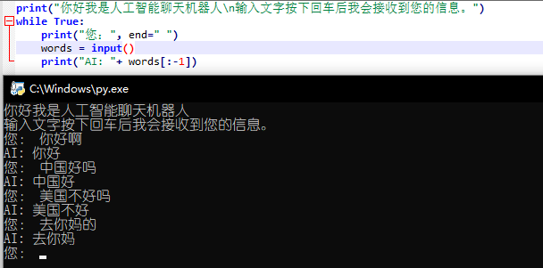

# 如何使用？

电脑有安装python, [点击下载](https://github.com/Ackermannn/PythonBase/releases/download/v1.0/ChatWithAI.py)py文件后，双击即可运行

# 使用示例

```
您好,我是智能聊天机器人
输入文字后再按下回车我就可以看到你的消息了。
您:你好啊
AI:你好
您:中国好吗
AI:中国好
您:美国不好吗
AI:美国不好
您:去你妈的
AI:去你妈
您:

```
如图


